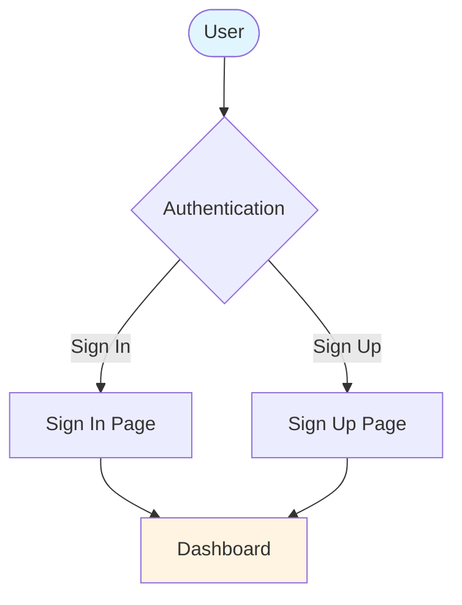
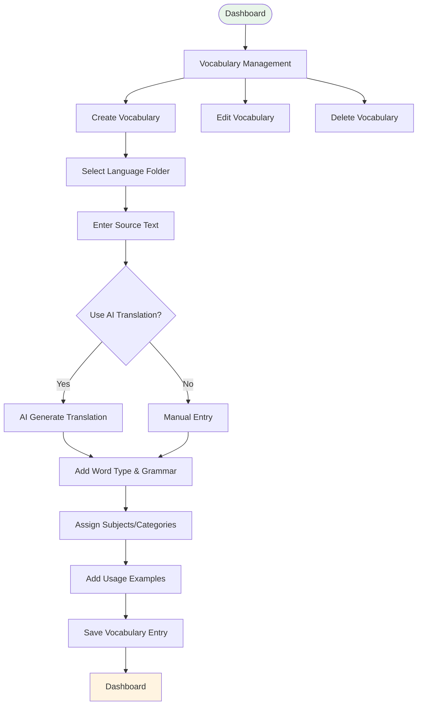
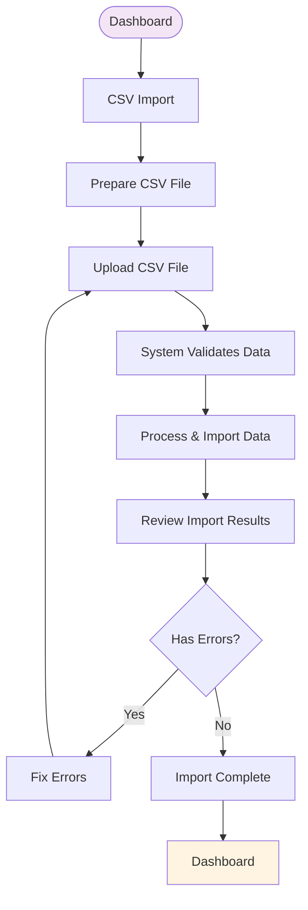
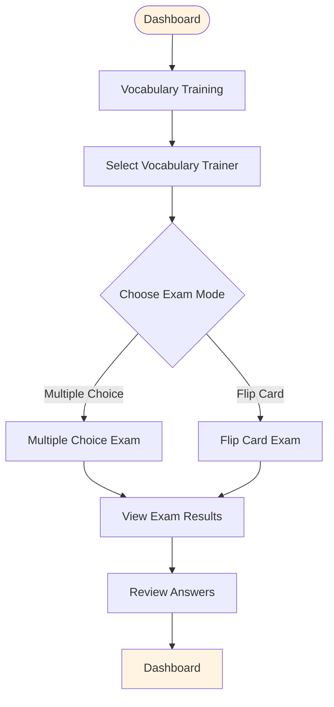
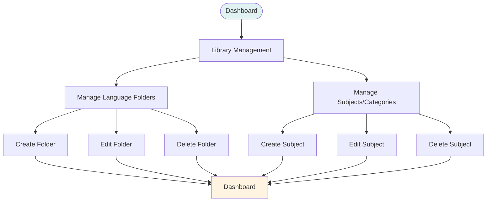

# User Flow Diagrams - Vocabulary Management

## 1. Authentication Flow

```mermaid
flowchart TD
    Start([User]) --> Auth{Authentication}
    Auth -->|Sign In| SignIn[Sign In Page]
    Auth -->|Sign Up| SignUp[Sign Up Page]
    SignIn --> Dashboard[Dashboard]
    SignUp --> Dashboard

    style Start fill:#e1f5ff
    style Dashboard fill:#fff4e1
```

## 2. Vocabulary Management Flow

```mermaid
flowchart TD
    Start([Dashboard]) --> VocabFlow[Vocabulary Management]
    VocabFlow --> CreateVocab[Create Vocabulary]
    VocabFlow --> EditVocab[Edit Vocabulary]
    VocabFlow --> DeleteVocab[Delete Vocabulary]

    CreateVocab --> SelectFolder[Select Language Folder]
    SelectFolder --> EnterText[Enter Source Text]
    EnterText --> UseAI{Use AI Translation?}
    UseAI -->|Yes| AIGenerate[AI Generate Translation]
    UseAI -->|No| ManualEntry[Manual Entry]
    AIGenerate --> AddDetails[Add Word Type & Grammar]
    ManualEntry --> AddDetails
    AddDetails --> AssignCategory[Assign Subjects/Categories]
    AssignCategory --> AddExamples[Add Usage Examples]
    AddExamples --> SaveVocab[Save Vocabulary Entry]
    SaveVocab --> Dashboard[Dashboard]

    style Start fill:#e8f5e9
    style Dashboard fill:#fff4e1
```

## 3. CSV Import Flow

```mermaid
flowchart TD
    Start([Dashboard]) --> CSVFlow[CSV Import]
    CSVFlow --> PrepareCSV[Prepare CSV File]
    PrepareCSV --> UploadCSV[Upload CSV File]
    UploadCSV --> ValidateCSV[System Validates Data]
    ValidateCSV --> ProcessCSV[Process & Import Data]
    ProcessCSV --> ReviewResults[Review Import Results]
    ReviewResults --> HasErrors{Has Errors?}
    HasErrors -->|Yes| FixErrors[Fix Errors]
    FixErrors --> UploadCSV
    HasErrors -->|No| ImportComplete[Import Complete]
    ImportComplete --> Dashboard[Dashboard]

    style Start fill:#f3e5f5
    style Dashboard fill:#fff4e1
```

## 4. Vocabulary Training Flow

```mermaid
flowchart TD
    Start([Dashboard]) --> TrainingFlow[Vocabulary Training]
    TrainingFlow --> SelectTrainer[Select Vocabulary Trainer]
    SelectTrainer --> ChooseMode{Choose Exam Mode}
    ChooseMode -->|Multiple Choice| MCQExam[Multiple Choice Exam]
    ChooseMode -->|Flip Card| FlipCardExam[Flip Card Exam]
    MCQExam --> ViewResults[View Exam Results]
    FlipCardExam --> ViewResults
    ViewResults --> ReviewAnswers[Review Answers]
    ReviewAnswers --> Dashboard[Dashboard]

    style Start fill:#fff3e0
    style Dashboard fill:#fff4e1
```

## 5. Library Management Flow

```mermaid
flowchart TD
    Start([Dashboard]) --> LibraryFlow[Library Management]
    LibraryFlow --> ManageFolders[Manage Language Folders]
    LibraryFlow --> ManageSubjects[Manage Subjects/Categories]

    ManageFolders --> CreateFolder[Create Folder]
    ManageFolders --> EditFolder[Edit Folder]
    ManageFolders --> DeleteFolder[Delete Folder]

    ManageSubjects --> CreateSubject[Create Subject]
    ManageSubjects --> EditSubject[Edit Subject]
    ManageSubjects --> DeleteSubject[Delete Subject]

    CreateFolder --> Dashboard[Dashboard]
    EditFolder --> Dashboard
    DeleteFolder --> Dashboard
    CreateSubject --> Dashboard
    EditSubject --> Dashboard
    DeleteSubject --> Dashboard

    style Start fill:#e0f2f1
    style Dashboard fill:#fff4e1
```

